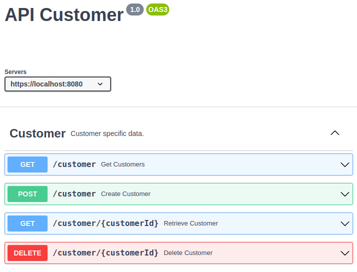

# Robot Framework Sample Test Application

This is the Robot Framework Sample Test application to be used for the Robot Framework test scripts defined at https://github.com/mydeveloperplanet/javamagrobotframework

The application is a basic Spring Boot application serving an API for creating *customers*,
retrieving *customers* and to delete *customers*. A *customer* has a *firstName*, a *lastName*, an *email* and a unique *customerId*.

Building and starting the application can be done as follows:
```bash
mvn clean verify
java -jar target/javamagrfwbackend-0.0.1-SNAPSHOT.jar
```

The API is available as a Swagger API at http://localhost:8080/swagger-ui/index.html

